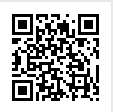

# NahamCon CTF Writeups

Fri, 12 June 2020, 15:00 UTC — Sat, 13 June 2020, 22:00 UTC

# Web 
## Agent 95 (50)
## Localghost (75)
## Phphonebook (100)
## Official Business (125)
## Seriously (125)
## Extraterrestrial (125)
## Rejected Sequel (150)
## B'omarr Style (200)
## Flag Jokes (200)
## Mongolian BBQ (225)
## Criss Cross (400)
## Trash The Cache (1000)

# Binary Exploitation
## Dangerous (75)
## SaaS (100)
## Shifts Ahoy (100)
## Syrup (100)
## Conveyor Belt (150)
## Ripe Reader (200)
## Free Willy (200)
## Leet Haxor (200)

# Scripting

## Dina (75)
## Rotten (100)
## Big Bird (100)

Tweets are of the format: `Tweet #{offset} {data}`.


Combine everything to yield a PNG file:

```python
import os
import tweepy as tw
import pandas as pd

consumer_key = '...'
consumer_secret = '...'
access_token = '...'
access_token_secret= '...'

auth = tw.OAuthHandler(consumer_key, consumer_secret)
auth.set_access_token(access_token, access_token_secret)
api = tw.API(auth, wait_on_rate_limit=True)

lines = []

for tweet in tw.Cursor(api.user_timeline,id='BigBird01558595').items():
    lines.append(tweet.text)

data = []
for l in lines:
	_, t1, t2 = l.split()
	data.append((int(t1[1:]), int(t2)))

byte_arr  = [t[1] for t in data]
binary_format = bytearray(byte_arr)
f = open('my_file', 'w+b')
f.write(binary_format)
f.close()
```

Get the PNG file that is qr code containing the flag:




## Merriam Webster (125)
## Really Powerful Gnomes (150)
## Signal2Noise (175)

# Miscellaneous

## Vortex (75)
## Fake File (100)
## Alkatraz (100)
## Trapped (100)
## Glimpse (125)
## Awkward (125)
## Roomie (150)
## SSH Logger (175)


# Mobile

## Candroid (50)
## Simple App (50)
## Secure Safe (100)
## Ends Meet (150)

# Forensics

## Microsooft (100)
## Volatile (125)
## Cow Pie (125)
## Lucky (150)

# Cryptography

## Docxor (75)
## Homecooked (100)
## Twinning (100)
## Ooo-la-la (100)
## Unvreakable Vase (125)
## December (125)
## Raspberry (125)
## Elsa4 (150)

# Steganography

## Ksteg (50)
## Doh (50)
## Beep Boop (50)
## Snowflake (75)
## My Apologies (75)
## Dead Swap (100)
## Walkman (100)
## Old School (125)

# OSINT

## Time Keeper (50)
## New Years Resolution (50)
## Finsta (50)
## Tron (75)

# Warmup

## Read The Rules (5)
## CLIsay (20)
## Metameme (25)
## Mr. Robot (25)
## UGGC (30)
## Easy Keesy (30)
## Peter Rabbit (40)
## Pang (40)