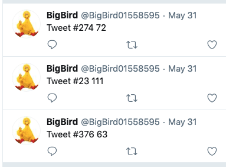

# Scripting
## Dina (75)


## Rotten (100)
## Big Bird (100)

Tweets are of the format: `Tweet #{offset} {data}`.



Combine everything to yield a PNG file:

```python
import os
import tweepy as tw
import pandas as pd

consumer_key = '...'
consumer_secret = '...'
access_token = '...'
access_token_secret= '...'

auth = tw.OAuthHandler(consumer_key, consumer_secret)
auth.set_access_token(access_token, access_token_secret)
api = tw.API(auth, wait_on_rate_limit=True)

lines = []

for tweet in tw.Cursor(api.user_timeline,id='BigBird01558595').items():
    lines.append(tweet.text)

data = []
for l in lines:
	_, t1, t2 = l.split()
	data.append((int(t1[1:]), int(t2)))

byte_arr  = [t[1] for t in data]
binary_format = bytearray(byte_arr)
f = open('my_file', 'w+b')
f.write(binary_format)
f.close()
```

Get the PNG file that is qr code containing the flag:


## Merriam Webster (125)

Looks like need to use `/usr/share/dict/words`

## Really Powerful Gnomes (150)
## Signal2Noise (175)