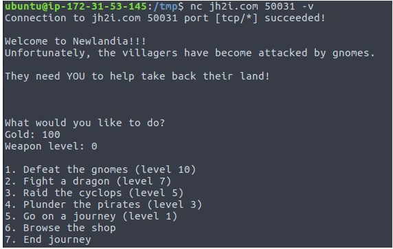

# Scripting
## Dina (75)

First things first. To me this was obviously DNA so I went down a very deep rabbit hole of trying to find the correct codon table to translate the DNA sequence into amino acid sequences that wound make sense. (I'll make my own challenge as a revenge one day)

Then I slept on it and got back with the hint that it's not really that much biology to it. Only to look at the characters three and three.

We'll need

```
import re
import socket
```

And this will assume you've created a `s` socket connection to the right place, but since it's not there anymore... I leave it out.

So with an initially empty translation table `t` :

```
def translate(data, t):
    for i in range(0, len(data), 3):
        cdn = data[i:i+3]
        print(d[cdn] if cdn in t else '?', end='')
```

While playing around I gathered a bunch of messages so I made a translate all function:

```
def tall(t, *ss):
    for i, s in enumerate(ss):
        print(i, end=': ')
        translate(s, t)
        print()
```

Then for the first part that was rather manual in my case I did a frequency analysis of the "codons"/tripplets of my sentences (`ss`) and started experimenting by assigning the most common as space. So I made myself a help function to set a translation 

```
def sett(t, ms, x, c):
    assert len(ms) / 3 == len(x), f'{len(ms) / 3} != {len(x)}'    
    if c in t.values():
        print(t)
        return
    idx = x.index('|')*3
    cdn = ms[idx: idx + 3]
    if cdn in t:
        print(cdn, t)
        return
    tt = {k: v for k, v in t.items()}
    t[cdn] = c
    return tt
```

A bit obscure but from the translated message I could replace one `?` with an `|` and use that as `x` then I also supplied the translation dictionary, the original message (`ms`) and the character `c` that I wanted.

Example where `alls` was all my strings that Dina had written that I had collected:

```
tt = sett(t, alls[10], '?: please respond |ith sghpp?', 'w')
```

As you can see here I'm guessing that there should be a `w` at the `|`. (It was much harder in the beginning). And as you can see, the message is to respond with some random letters.

Here's how it looked after a while:

```
no?e? sorry? that is not right?
?? send the string ??t??????i?? ?a?? to me
?? send ?a?? ?re???i?hy as a string
?? send the string ?????? ?a?? to me
?? send this ?a??? ???????
?? send r?tam??? as a string ?a?? to me
?? enter this ?a?? to the me ?mt???ner?em??s
```

Experimenting with common letters I found that the message Dina always replies with when we do wrong was easiest to start guessing letters. With this I built up 

```
t = {'ATA': ' ',
 'ATG': 'i',
 'ACG': 's',
 'TCT': 'n',
 'GGA': 'o',
 'TTC': 't',
 'TCA': 'r',
 'TTT': 'g',
 'CGC': 'h',
 'CGA': 'a',
 'AAA': 'y',
 'GGC': 'e',
 'TTG': 'd',
 'TCC': 'm',
 'CCA': 'b',
 'GTT': 'c',
 'AAG': 'k',
 'GTG': 'p',
 'GCT': ':',
 'TGC': 'l',
 'TCG': '!',
 'CCG': 'w'}
```

Now there was still a few `?` left that there was no evidence for, so time for automation.

I found the question patterns

```
patterns = ['send this back: (.*)',
 'enter the string: (.*)',
 'back to the me (.*)',
 'respond with (.*)',
 'send (.*) as a string back',
 'the string (.*) back to me',
 'please send back (.*)',
 'go ahead and send (.*)',
 'send back (.*) as a string',
 'send the message back: (.*)']
```

Then: 

```
def get_word(t):
    data = read_all()
    st = data.decode().split('\n')[0]
    ts = tall(t, st)[0]
    tw = ''
    found = False
    for p in patterns:
        found = re.findall(p, ts)
        if found:
            return st, ts, found[0]
    print('>>> new pattern!')
    return None, None, None
```

I apparently forgot the `read_all` method, but it basically just read what Dina prompted from the socket until the `>` 

And if there was only one type of `?` in the word I automated guessing it from unused letters:

```

def guess_fill(t, ol, l, w):
    if '?' not in w:
        return w, {}
    i0 = l.index(w)
    miss = list(set(ol[(i0 + i) * 3: (i0 + i + 1)*3] for i, c in enumerate(w) if c == '?'))
    if len(miss) > 1:
        return w, {}
    fr = [c for c in string.ascii_lowercase if c not in t.values()]
    gc = fr[random.randint(0, len(fr) - 1)]
    gt = {miss[0]: gc}
    return w.replace('?', gc), gt
```

 I was stuck the longest time because I had coded in lower case while Dina was speaking in upper!

The main loop:

```
while not flag:
    flag = False
    s = socket.socket(socket.AF_INET, socket.SOCK_STREAM)
    s.connect(('jh2i.com', 50035))
    gw = {}
    print("=================================")
    while True:
         gw.update(**t)
         ol, l, w = get_word(gw)
         if l and 'flag' in l:
             print(l)
             flag = True
             break         
         if ol is None:
             print('?! bad response')
             break
         t.update(**gw)
         w2, gw = guess_fill(t, ol, l, w)
         if w2 is None:
             print("No clue restarting")
             break         
         if gw:
             print("Guessing extension", gw)
         s.sendall(f'{w2.upper()}\n'.encode())
         print('SENT:', w2.upper())
```

## Rotten (100)


## Big Bird (100)

Tweets are of the format: `Tweet #{offset} {data}`.


Combine everything to yield a PNG file:

```python
import os
import tweepy as tw
import pandas as pd

consumer_key = '...'
consumer_secret = '...'
access_token = '...'
access_token_secret= '...'

auth = tw.OAuthHandler(consumer_key, consumer_secret)
auth.set_access_token(access_token, access_token_secret)
api = tw.API(auth, wait_on_rate_limit=True)

lines = []

for tweet in tw.Cursor(api.user_timeline,id='BigBird01558595').items():
    lines.append(tweet.text)

data = []
for l in lines:
	_, t1, t2 = l.split()
	data.append((int(t1[1:]), int(t2)))

byte_arr  = [t[1] for t in data]
binary_format = bytearray(byte_arr)
f = open('my_file', 'w+b')
f.write(binary_format)
f.close()
```

Get the PNG file that is qr code containing the flag:


## Merriam Webster (125)

Looks like need to use `/usr/share/dict/words`, and has to be linux, the Mac one is differnt BOO

```python
from pwn import *
dic_list = {s.lower()[:-1] for s in open('/usr/share/dict/words').readlines()}

def get_fake_list(wl):
    return list(filter(lambda w: w not in dic_list, wl.split(" ")))


def get_real_list(wl):
    return list(filter(lambda w: w in dic_list, wl.split(" ")))

funcs = {
    ": Can you tell me how many words here are NOT real words?":
        lambda wl: len(get_fake_list(wl)),
    ": Can you tell me which words here are NOT real words IN CHRONOLOGICAL ORDER? Separate each by a space.":
        lambda wl: " ".join(get_fake_list(wl)),
    ": Can you tell me which words here are NOT real words IN ALPHABETICAL ORDER? Separate each by a space.":
        lambda wl: " ".join(sorted(get_fake_list(wl))),
    ": Can you tell me how many words here ARE real words?":
        lambda wl: len(get_real_list(wl)),
    ": Can you tell me which words here ARE real words IN CHRONOLOGICAL ORDER? Separate each by a space.":
        lambda wl: " ".join(get_real_list(wl)),
    ": Can you tell me which words here ARE real words IN ALPHABETICAL ORDER? Separate each by a space.":
        lambda wl: " ".join(sorted(get_real_list(wl))),
}

def main():
    r = remote('jh2i.com', 50012)

    while True:
        prompt = r.recvuntil("\n", drop=True).decode()
        if prompt not in funcs:
            log.info(f"Got flag >>>>>>>> {prompt}")
            exit()
        log.info(prompt)

        # Read the words
        words = r.recvuntil("\n", drop=True).decode()

        # Compute and send the response
        resp = funcs[prompt](words)
        r.sendlineafter(">", str(resp).encode())

        # Get status
        status = r.recvuntil("\n", drop=True).decode()

        if "fired" in status.lower():
            log.error(f"Oops, failed task for prompt ({prompt})")
        else:
            log.info(status)


if __name__ == "__main__":
    main()
```

## Really Powerful Gnomes (150)



## Signal2Noise (175)